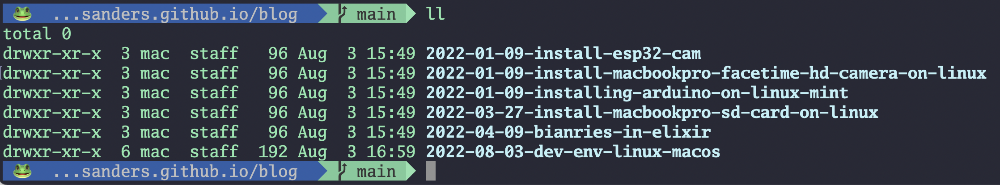
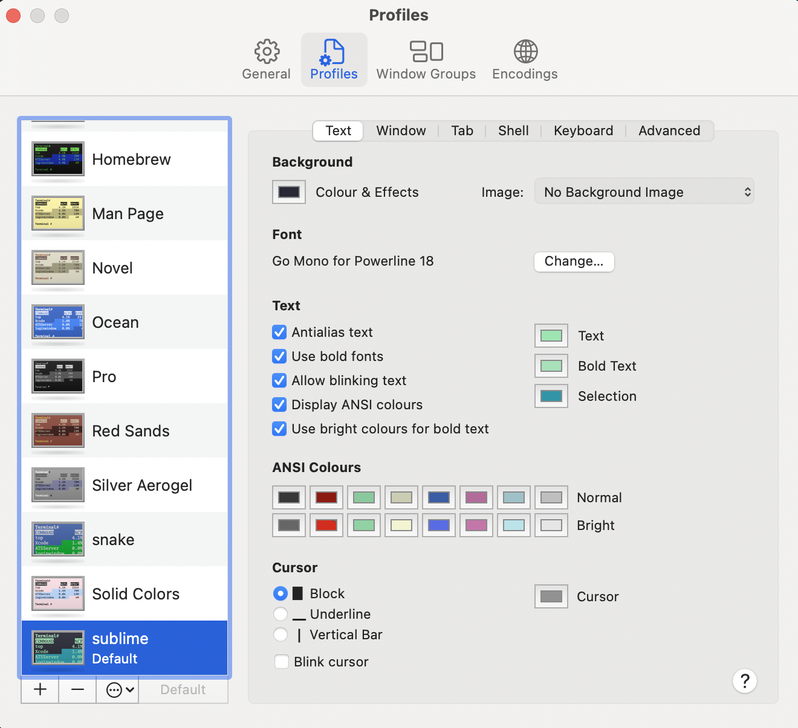

# Porting develpment environment from Linux to MacOs

_2022-08-03_

- [Porting develpment environment from Linux to MacOs](#porting-develpment-environment-from-linux-to-macos)
- [Transferring files](#transferring-files)
- [Homebrew](#homebrew)
- [Git](#git)
- [Visual Studio Code](#visual-studio-code)
- [Oh My ZSH](#oh-my-zsh)
  - [Chose a terminal](#chose-a-terminal)
  - [Install OMZ](#install-omz)
    - [Set OMZ theme](#set-omz-theme)
    - [Custom promt](#custom-promt)
- [Asdf](#asdf)
- [Terminal](#terminal)

# Transferring files

The new computers are comming with no USB2 nor SD card readers, therefore to send files from one PC to the other I use NetCat.
Disclaimer, NetCat (NC) is not a secure tool, to be used in closed networks, in other words, at home. Use any other tools of the kind of transferring sensitive data.

On the receiver host MACOS

    nc -l 22222 > my_file.zip

where `-l` is listen port, `my_file.zip` is the name of the file to be received.    

On the sender host Linux

    nc -w3 192.168.1.200 22222 < my_file.zip

where `-w3` is 3 seconds timeout, followed by the receiver's IP and port. `my_file.zip` is the name of the file to be transmitted.    

# Homebrew

https://brew.sh/

On MACOS install with

    /bin/bash -c "$(curl -fsSL https://raw.githubusercontent.com/Homebrew/install/HEAD/install.sh)"

This will also install the `Command Line tools XCode`

Run these two commands in your terminal to add Homebrew to your PATH:

    echo 'eval "$(/opt/homebrew/bin/brew shellenv)"' >> /Users/$USER/.zprofile
    eval "$(/opt/homebrew/bin/brew shellenv)"

# Git

    brew install git

Since we are here let's configure it.

As reminder in case you enter in VI editor: 
- press `i` for insert mode (edit) 
- press `escape` then `:q!` to exit without saving.
- press `escape` then `:wq!` to exit saving.

to switch to vscode just add the following:

    git config --global e

This will create a config file `/Users/$USER/.gitconfig`    

Insert the following lines

    [core]
    editor = code --wait

now you can open it again to edit it with vscode

    git config --global e

and add the rest of your settings

```ini
[user]
    name = Nane Family
    email = email@gmail.com

[core]
    editor = code --wait

[diff]
    tool = vscode

[difftool "vscode"]
    cmd = code --wait --diff $LOCAL $REMOTE

[merge]
    tool = vscode

[mergetool "vscode"]
    cmd = code --wait $MERGED

[alias]
    st = status
```


# Visual Studio Code

Download VSCode, to install it just move it to the applications folder.

Add VSCode to the commnad line

1. open VSCode
2. press: cmd + shift + P
3. select: `Shell Command: Install code in PATH`

now it can be launched from the terminal using `code`

# Oh My ZSH

In order to instal `OMZ`, `ZSH` has to be the default terminal.
A good stating page is this page:

https://www.sitepoint.com/zsh-tips-tricks/

## Chose a terminal 

After MACOS Catalina `ZSH` is set as the default terminal, before used to be `Bash`.

If not, set it as default:

    chsh -s $(which zsh)

You can always revert back to `Bash` using: `chsh -s $(which bash)`

## Install OMZ 

https://gabrieltanner.org/blog/customizing-terminal-using-ohmyzsh/

Provides an enhancement to the terminal with many plugins.

    sh -c "$(curl -fsSL https://raw.github.com/robbyrussell/oh-my-zsh/master/tools/install.sh)"

Note: Git is required by OMZ, by now Git should be installed.

### Set OMZ theme

There are many features to configure in OMZ but here we are going to setup the most important.

The configuration is set in `~/.zshrc`

    ZSH_THEME="agnosterSnake"
    plugins=(zsh-autosuggestions)    
    prompt_context() {prompt_segment blue default "🐸" }
    alias ll="ls -l"
    alias lla="ls -la"

Note: the theme is `Agnoster` but here I am using an adapter version `agnosterSnake` which I will later explain why I needed.

Setting the coolest theme `Agnoster` requires a font to render the promt arrows and Git status.

https://github.com/powerline/fonts#installation

1. clone

    `git clone https://github.com/powerline/fonts.git --depth=1`

2. install

    `cd fonts`
    `./install.sh`

3. clean-up a bit

    `cd ..`
    `rm -rf fonts`

4. test it

Paste the following command on the console, it should show special symbols:

    echo "\ue0b0 \u00b1 \ue0a0 \u27a6 \u2718 \u26a1 \u2699"


If this set of characters only work in VSCode but not in the external terminal then the issue is in the font, change it 

    git clone https://github.com/abertsch/Menlo-for-Powerline.git
    cd Menlo-for-Powerline
    cp "Menlo for Powerline.ttf" ~/.fonts

Then in Terminal change in settings the font to `Go Mono for Powerline`

### Custom promt

In the configuration `~/.zshrc` I used the different theme `ZSH_THEME="agnosterSnake"`
Here I am using my version of the theme, I called `agnosterSnake` to fix a color contrast issue on MACOS. I just duplicated the `agnoster` theme file which is located in  `~/.oh-my-zsh/themes`. This I assume it could be fixed by changing the Theme but I was having some issues.

Here is the change

_~/.oh-my-zsh/themes/agnosterSnake.zsh-theme_
```bash
    # Dir: current working directory
    prompt_dir() {
    # Original settings:
    # prompt_segment blue $CURRENT_FG ' %~ '

    # Altered settings:
    # added white as foreground color to avoid low contrast to dark blue in MacOs
    # added a limit of 25 chars when the directory path is too long 
    prompt_segment blue white ' %25<...<%~%<< '
    }
````


After the Terminal is configured, check for any configuration you had added to the `~/.bash_profile`, it can be the case that other programs are installed and configured in this file such as path or settings, these settings should be moved to `~/.zshrc`

# Asdf

    https://asdf-vm.com/guide/getting-started.html#_2-download-asdf

download with 

    brew install asdf

Add asdf.sh to your ~/.zshrc with:

    echo -e "\n. $(brew --prefix asdf)/libexec/asdf.sh" >> ${ZDOTDIR:-~}/.zshrc

# Terminal 

Here is a set of colors I like for the terminal 



The settings can be imported using the file [sublime.terminal](sublime.terminal)

to import it, go to `Terminal/preferences/profile` and below the list of themes there is button "...", in there select `import` and open `sublime.terminal` file. 

In order to keep GIT branch icons working the font must be set to `Go Mono for Powerline 18`.

